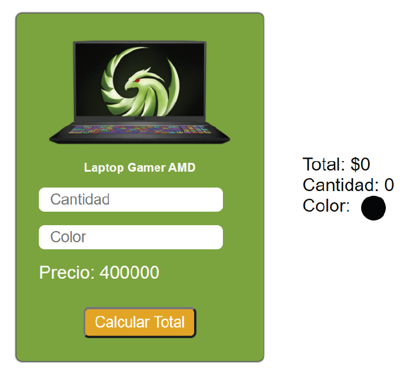

<div align="center">

# Desafío 1: Manipulación del DOM y condicionales

</div>

El objetivo es implementar la tarjeta de un producto expuesto en una tienda online y agregar interacción de usuario permitiendo modificar la cantidad y el color del producto.

**Descripción**

Deberás hacer uso de las herramientas aprendidas para manipular elementos del DOM como el método `querySelector` y la modificación de estilos a través del objeto `style` de cada elemento.

A continuación se muestra lo que se debe maquetar:

<div align="center">



</div>

El usuario deberá poder tipear la cantidad del producto y el color por medio de los inputs, posteriormente al presionar el botón *Calcular Total* se deberá mostrar a la derecha el Total a pagar por el producto, la cantidad y el color especificado.

<div align="center">


</div>

## Requerimientos

1. Agregar todos los elementos necesarios dentro del HTML.
2. Agregar el evento en el elemento correcto utilizando el tipo de evento pedido.
3. Seleccionar y guardar en variables los elementos a modificar.
4. Modificar el DOM para actualizar el total a pagar.
5. Modificar el DOM para actualizar la cantidad de productos especificado en el input.
6. Modificar el DOM para cambiar el color del círculo utilizando el especificado por el usuario.

**Validaciones**
1. Validar que el campo cantidad del producto solo pueda aceptar valores numéricos positivos mayor que 0 y menor que 10. Si se añade una cantidad mayor que 9, se debe mostrar una alerta indicando que se ha superado el stock del producto.
2. El total sólo se puede calcular si se ingresa una cantidad y el color del producto.
3. Si no se selecciona el color del producto o el campo de cantidad está vacío, se debe mostrar una alerta al usuario indicando que ninguno de los dos campos debe estar vacío.

## Pasos para ejecutar el Desafío

Ejecuta los siguientes comando Bash:

- En el directorio raíz del desafío, ejecute el siguiente comando para instalar las dependencias:

```bash
npm install
```
- Por último, ejecute el servidor *Vite* en modo de desarrollo con el siguiente comando:

```bash
npm run dev
``` 